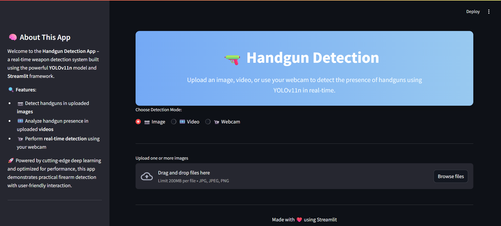
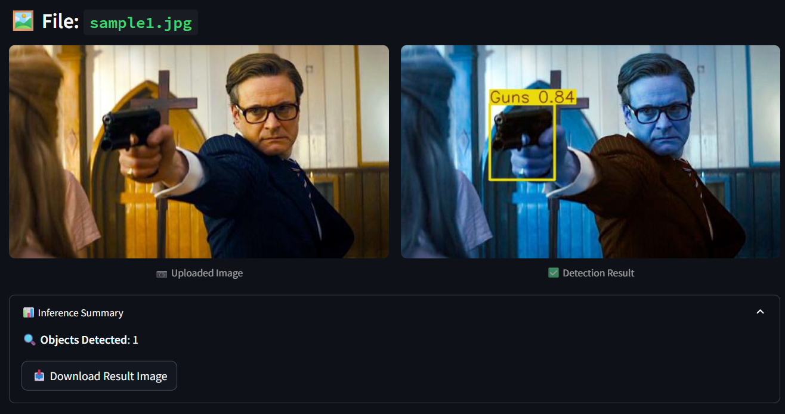
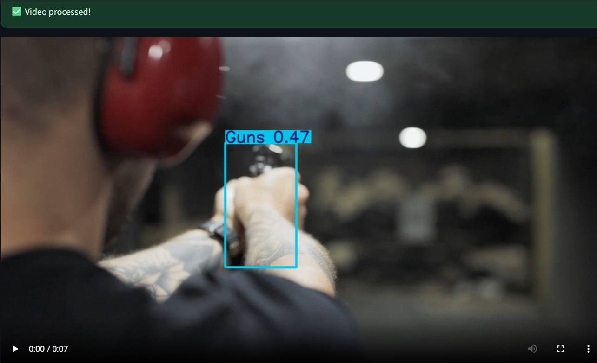
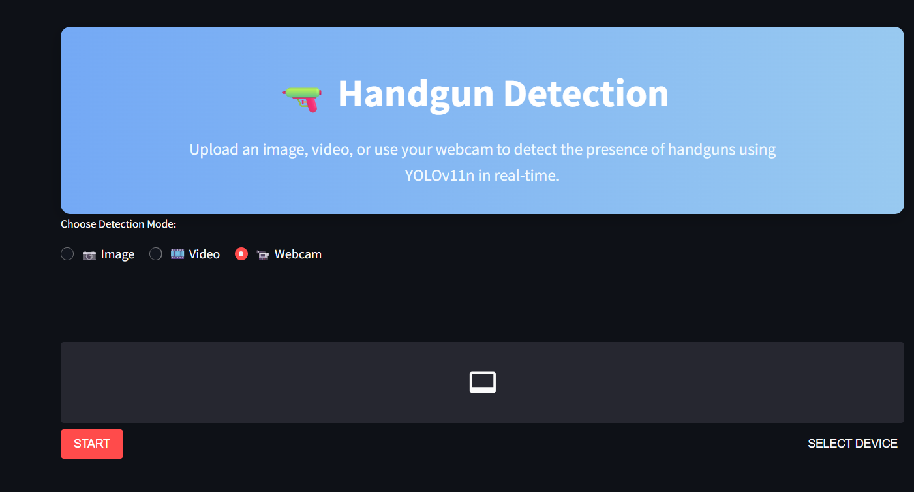

# 🔫 Handgun Detection using YOLOv11n

This project implements a **Handgun detection system** using the **YOLOv11n (nano)** object detection model. Designed for public safety and smart surveillance, the system can analyze images, videos, live video feeds from webcams or CCTV to automatically identify handguns and raise alerts.

## 📸 Project Overview

The system leverages computer vision and deep learning to detect handguns in:
- Images
- Videos
- Live camera feeds (Webcam/CCTV)

Upon detection, it highlights the handgun with a bounding box, displays a confidence score, and triggers an audible alarm.

---

## Hosted URL

You can visit the website here [Handgun Detection](https://handgundetection-e4njfxpc39bapnuge8kg8j.streamlit.app)

---

## 🚀 Features

- 📷 **Image Detection**: Upload one or multiple images and detect the presence of handguns with bounding boxes and detection scores.
- 🎞️ **Video Detection**: Upload a video file and get a processed video with detection overlays. Option to download the result.
- 📹 **Webcam Detection**: Run real-time handgun detection using your webcam.
- **Transfer Learning** using ~2,600 handgun images
- 🔊 **Smart Alarm**: In webcam mode, if a handgun is detected **continuously for 5 seconds** with confidence **> 0.7**, an alarm is triggered.
- 🌐 **Responsive UI**: Optimized layout with a clean, mobile-friendly design.
- **Low Resource Usage** – efficient on CPU-only machines
- 📤 **Custom File Upload**: Enhanced drag-and-drop file uploader with visual progress.

---

## ⚙️ Technologies Used

| Component         | Tech Used                       |
|-------------------|----------------------------------|
| Backend Model     | YOLOv11n (Ultralytics)           |
| App Framework     | Streamlit                        |
| Webcam Stream     | streamlit-webrtc                 |
| Media Processing  | OpenCV, PIL, ImageIO             |
| UI Enhancements   | HTML/CSS in Streamlit + Gradients|

---

## 🏗️ System Architecture

```plaintext
[Live Feed / Image / Video]
        ↓
[Preprocessing → YOLOv11n Detection]
        ↓
[Bounding Box + Confidence Score]
        ↓
[Alert Trigger (Sound)]
        ↓
[Display Output with Overlays]
```

---

## ⚙️ Working Modes

- **Image Detection**: Annotates handgun in static image
- **Video Detection**: Detects handgun frame-by-frame
- **Live Feed Detection**: Webcam-based real-time detection with audible alert

---

## 🧠 How It Works

1. **YOLOv11n model** is loaded once when the app starts.
2. Depending on user input (image, video, or webcam):
   - The input is processed frame-by-frame (video/webcam).
   - The model returns predictions with bounding boxes and confidence scores.
3. Webcam mode:
   - If a gun is detected continuously for 5 seconds (confidence > 0.7), a **siren alarm** is played.
4. Final results are shown and available for **download** (image/video).

---

### 🎥 Visual Demonstration

#### 🏠 Homepage

This is the landing page of the real-time handgun detection system interface.



---

#### 🖼️ Image Detection

The model detects handguns in static images by drawing bounding boxes and displaying confidence scores.



---

#### 📼 Video Detection

The model processes each frame of a video stream and overlays bounding boxes with confidence scores on detected handguns.



---

#### 📷 Webcam (Live Feed) Detection

Live handgun detection using a webcam. The system immediately detects handguns and triggers visual + audio alerts.



---

## 📊 Model Performance

| Metric                      | Value         |
|----------------------------|---------------|
| Classification Accuracy    | 0.74          |
| IOU-based Accuracy         | 0.65          |
| F1 Score                   | 0.78          |
| Inference Speed            | ~0.4 ms/frame |
| FPS (Live Feed)            | 30–40         |

---

## 🧾 Dataset Overview

The handgun detection model was trained on a **custom handgun image dataset** created using [Roboflow](https://roboflow.com), comprising:

- ✅ **2,600 training images**
- ✅ **300 validation images**
- ✅ Format: YOLOv5/YOLOv11-compatible (`.txt` + `YAML`)
- ✅ Single class: `gun`

### 🔁 Augmentations Applied:
- Rotation
- Brightness & Contrast Adjustment
- Random Masking
- Spatial Flip and Scaling

 Each image was labeled using Roboflow’s auto-labeling and manually corrected to ensure bounding box accuracy. These variations improve generalization across lighting and occlusion scenarios.

---

## 🧠 Model Development Details

### 🧰 Model Architecture: YOLOv11n

YOLOv11n was selected for its:
- ⚡ High inference speed (~0.4ms per frame)
- 🪶 Lightweight architecture ideal for edge and CPU-only devices
- 🎯 Competitive accuracy for real-time surveillance use cases
- 🧠 Attention-enhanced backbone and optimized spatial pyramids

---

### 🏋️‍♂️ Model Training

| Aspect                  | Description                                   |
|------------------------|-----------------------------------------------|
| Base model             | Pre-trained YOLOv11n (COCO-trained)           |
| Transfer learning      | Fine-tuned on handgun dataset (2,600 images)  |
| Dataset format         | YOLOv5/YOLOv11 compatible (via Roboflow)      |
| Validation split       | 300 images for validation                     |
| Training tool          | Ultralytics CLI with YAML configuration       |
| Training platform      | Jupyter Notebook (PyTorch backend)            |
| Augmentations          | Rotation, masking, brightness & contrast shift|
| Custom YAML            | 1 class: `gun`, with dataset path references  |

---

### 🧪 Evaluation Highlights

- ✅ **F1 Score**: 0.78  
- ✅ **Classification Accuracy**: 0.74  
- ✅ **IOU-based Accuracy**: 0.65  
- 🚀 **Live Feed FPS**: 30–40 FPS  
- ⏱️ **Inference Speed**: ~0.4 ms/frame  

| Condition            | Performance Notes |
|----------------------|-------------------|
| 🕶️ Low light         | Reduced confidence |
| 🔍 Small object size | Reduced accuracy   |
| 📉 <30% visibility   | Detection fails     |
| 🔆 Well-lit scenes   | High confidence     |
| 📺 480p input        | Faster but less precise detection |

---

### ⚠️ Limitations

- Detection may fail in extreme **low-light or blurry scenarios**.
- **High occlusion or poor visibility (<30%)** impacts performance.
- Low-resolution inputs can speed up inference but reduce **confidence scores**.

---

### 🧠 Tools & Libraries Used

| Tool / Library      | Purpose                                           |
|---------------------|---------------------------------------------------|
| **YOLOv11n (Ultralytics)** | Model architecture & training                |
| **PyTorch**         | Backend for deep learning model execution         |
| **Roboflow**        | Dataset annotation, augmentation & export         |
| **Jupyter Notebook**| Model training, experimentation, and logging      |
| **OpenCV + PIL**    | Image/video/frame processing and overlay drawing  |

---

## 🔮 Future Enhancements

- Multi-class detection (e.g., knives, rifles)
- Real-time alerts via **SMS/Email**
- Integration with **smart city surveillance**
- Support for more advanced YOLOv11 variants (YOLOv11s/m/l)
- Diverse and larger datasets for better accuracy

---

## 📦 Setup Instructions

> 🔹 Clone this repo

```bash
git clone https://github.com/Yaswanth-Kalla/Handgun_Detection.git
cd handgun-detection-app
```

> 🔹 Create and activate a virtual environment:

```bash
python -m venv venv
source venv/bin/activate  # on Linux/Mac
venv\Scripts\activate   # on Windows
```

> 🔹 Install dependencies:

```bash
pip install -r requirements.txt
```

> 🔹 Place your `best.pt` YOLOv11n model in `model/best.pt`

> 🔹 Run the app:

```bash
streamlit run app.py
```

---

## 📌 Use Cases

- School or Campus Security Demonstrations
- Smart CCTV / Surveillance Simulation
- Research in Computer Vision & Deep Learning
- Object Detection Prototyping

---

## ❤️ Acknowledgements

- [Ultralytics YOLO](https://github.com/ultralytics/ultralytics)
- [Streamlit](https://streamlit.io/)
- [Streamlit WebRTC](https://github.com/whitphx/streamlit-webrtc)

---

## 👨‍💻 Contributors

- [YASWANTH](https://github.com/Yaswanth-Kalla)
- [JAYA KRISHNA](https://github.com/Krishna-JK-14)
- [PRANAV](https://github.com/Pranav4005)
- [VISHESH](https://github.com/VisheshChowdary)

